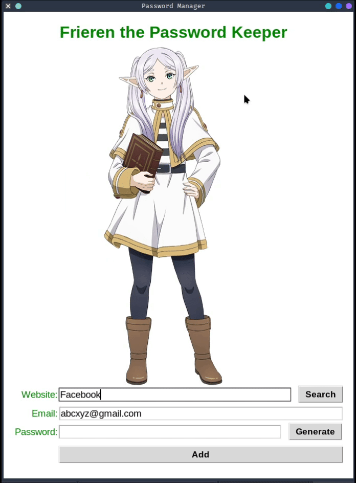

# Frieren the Password Keeper 🔐

A simple **desktop password manager** built with **Python + Tkinter**.  
It lets you generate strong passwords, save them locally, and quickly search for saved credentials.

---

## Features

- Generate strong random passwords
- Copy password to clipboard automatically
- Save website, email, and password in a local `data.json`
- Search saved credentials by website
- Simple and clean Tkinter UI

---

## Demo



> `frieren.gif` is a short screen recording of the app in use  
> (generate password → save → search)

---

## How it works

- Passwords are stored locally in `data.json`
- Data format:
  ```json
  {
    "example.com": {
      "email": "user@example.com",
      "password": "generated_password"
    }
  }
