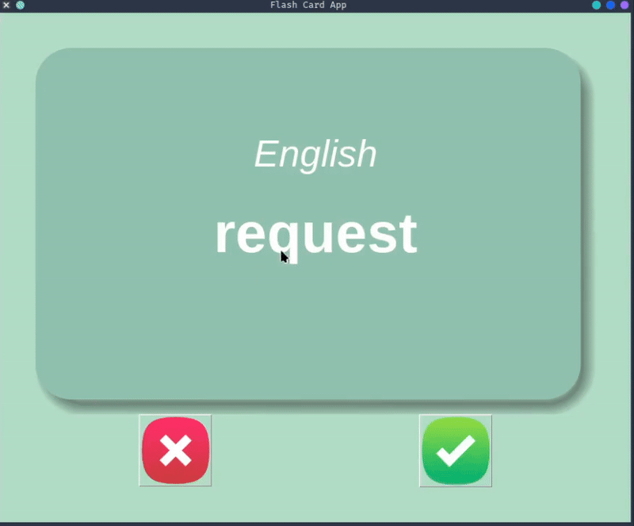

# 🎴 Flash Card App

A simple interactive flashcard app to learn French vocabulary using Python and Tkinter.

## Demo



## What It Does

- Shows French words on card fronts
- Automatically flips to show English translations after 3 seconds
- Click ✅ to mark words as learned
- Click ❌ to skip and review later
- Automatically saves progress

## Features

✨ Clean card-based interface  
📊 Tracks learned vs. unlearned words  
⏱️ Auto-flip timer  
💾 Saves progress between sessions  

## Run It

```bash
python main.py
```

Requires: `pandas`, `tkinter` (built-in)
